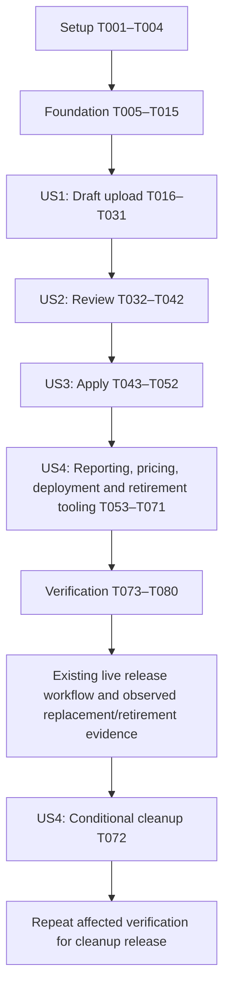

# Tasks: Liquidity CSV Uploads

**Feature**: `031-liquidity-redesign-statement-upload` | **Generated**: 2026-09-21
**Input**: [plan.md](./plan.md), [spec.md](./spec.md), [research.md](./research.md), [data-model.md](./data-model.md), [quickstart.md](./quickstart.md), and the [API contract](./contracts/liquidity-statements.openapi.yaml), [canonical schema](./contracts/csv-import-schema.json), [normalization rules](./contracts/csv-normalization.md), [authorization matrix](./contracts/authorization-matrix.md), [threat model](./contracts/threat-model.md), [rollout contract](./contracts/migration-rollout.md), [operations contract](./contracts/observability-cost-contract.md), and [architecture decision](./contracts/architecture-decision.md).

**Scope**: Implement deterministic CSV uploads, review, whole-account snapshots, and Liquidity integration. Each file is authoritative for its explicitly bound accounts within one custodian/entity. Same-ticker holdings at other accounts remain untouched. No PDF/OCR/BDA fallback, new worker service, or monthly snapshot key. Preserve the page layout and K-1 ingestion.

**Tests**: Required by FR-026 and the feature acceptance criteria. Write behavioral tests before the corresponding implementation; confirm they detect missing behavior, then make them pass. Database migration/concurrency/recovery acceptance must use the local PostgreSQL test database and cannot be satisfied by skipped tests. Use synthetic broker-format fixtures only.

**Existing work to retain**:
- `apps/api/package.json` now lists `csv-parse` as `^7.0.2`, with a changed `package-lock.json`. Verify and pin the selected version; do not add another parser.
- Default-false strict configuration, provider/cache/closing-refresh guards, and focused tests already exist in `apps/api/src/config.ts`, `apps/api/src/modules/market-data/market-data.service.ts`, `apps/api/src/modules/market-data/market-data.provider.ts`, and `apps/api/tests/real-time-equities.config.test.ts`. Planned Terraform wiring exists in `infra/aws/terraform/main.tf` and `infra/aws/terraform/variables.tf`. Extend this baseline for neutral CSV holdings, UI capabilities, and deployment coverage rather than duplicating it.
- Routine live deployment is `scripts/deployment/deploy-live-production.mjs` using `infra/aws/live-production-target.json` and `scripts/deployment/live-production.mjs`; the live stack is in `us-west-1`, with existing K-1 resource overrides. `infra/aws/terraform/production.tfvars` configures the separate planned topology, so Terraform changes alone do not establish explicit flag injection into a routine live release.
- Existing capital-activity edits belong to separate work. These tasks do not roll them back or treat them as part of CSV implementation. Checkboxes now reflect local implementation and verification; T072 is the outstanding conditional live cleanup.
- Migration names `047_liquidity_sources.sql` and `048_liquidity_csv_imports.sql` are the next available names at generation time; recheck numbering before adding them. New paths below are intentional implementation targets.

**Execution notation**: Paths are repository-relative. `[P]` denotes distinct-file tasks eligible to run together after the phase prerequisites and any explicit dependencies have completed. Unmarked implementation tasks run in listed order unless the dependency section permits otherwise. Shared files such as `config.ts`, `app.ts`, route registries, and client contracts have one writer at a time.

## Phase 1: Setup

**Goal**: Confirm dependencies, synthetic inputs, current behavior, and actual runtime ownership.

**Independent acceptance**: Dependency resolution is reproducible; fixtures contain no client records; the baseline identifies all source/pricing/deployment consumers.

- [X] T001 Verify the existing `csv-parse` installation against Node 22 and the API ESM build, pin the reviewed version in `apps/api/package.json` and `package-lock.json`, and record runtime dependency audit results in `specs/031-liquidity-redesign-statement-upload/evidence/dependencies.md`.
- [X] T002 [P] Create synthetic examples for both broker layouts and a fixture builder covering duplicate symbols, incomplete basis, cash, footer controls, foreign currency, bonds/options, malformed records, and empty accounts in `apps/api/tests/liquidity-statements/fixtures/positions.csv`, `apps/api/tests/liquidity-statements/fixtures/merrill-holdings.csv`, and `apps/api/tests/liquidity-statements/fixtures/buildCsvFixture.ts`.
- [X] T003 [P] Characterize retained holdings, KPIs, allocations, filters, dashboard values, exports, and recorded history using synthetic inputs in `apps/api/tests/liquidity-csv-equivalence.test.ts`; distinguish intentional coverage changes from regressions.
- [X] T004 [P] Record source reads, current quote callers, account ownership, original storage utilities, active Plaid consumers, and the live-versus-planned deployment paths in `specs/031-liquidity-redesign-statement-upload/evidence/source-inventory.md`, using `scripts/deployment/live-production.mjs`, `infra/aws/live-production-target.json`, and `docs/deployment/live-aws-production.md` as the live release baseline.

**Checkpoint**: Setup artifacts establish the implementation baseline. No production mutation is part of setup.

## Phase 2: Foundational prerequisites

**Goal**: Establish exact values, shared contracts, scoped durable records, configuration, and source storage.

**Independent acceptance**: Contract and migration checks pass against a local database; storage capabilities remain scoped and immutable; new foundations do not change live holdings.

### Tests and shared contracts

- [X] T005 Add schema/DTO parity tests for every documented request/response, state, decimal string, null availability, evidence reference, and pricing capability in `apps/api/tests/liquidity-statements/schema.contract.test.ts`; validate fractional/negative money and ratio bounds against the JSON/OpenAPI artifacts before relying on their regexes.
- [X] T006 Implement shared CSV/source-account/coverage/capability types in `packages/types/src/liquidity-statements.ts` and strict Zod schemas/finite issue codes in `apps/api/src/modules/liquidity-statements/liquidity-statement.zod.ts`; align the JSON/OpenAPI schemas if tests expose encoding or precision inconsistencies, without changing confirmed product semantics. (Depends on T005.)
- [X] T007 [P] Add exact numeric grammar, signed parentheses, percentage units, rounding, overflow, excess precision, zero/null, and leading-zero identifier tests in `apps/api/tests/liquidity-statements/decimal.test.ts`.
- [X] T008 [P] Add clean/upgrade/repeated-migration tests for account/entity scope, numeric precision, evidence foreign keys, unique source occurrences, revision keys, and transaction rollback in `apps/api/tests/liquidity-source-migration.integration.test.ts`.
- [X] T009 Implement bounded scaled-BigInt parsing/arithmetic in `apps/api/src/modules/liquidity-statements/csv/decimal.ts` using money/quantity/price scale 8 and ratio scale 12, explicit half-away-from-zero rounding, and no native-number authoritative calculations. (Depends on T007.)
- [X] T010 Add `apps/api/src/infra/db/migrations/047_liquidity_sources.sql` for neutral accounts, immutable account snapshots/positions, effective precision/revisions/current pointers, active ingestion ownership, legacy lineage, coverage, and additive neutral valuation foreign keys; preserve legacy tables/constraints and financial evidence. (Depends on T008.)
- [X] T011 Add `apps/api/src/infra/db/migrations/048_liquidity_csv_imports.sql` for imports, scoped accepted-file hashes, capabilities/reservations, leased parse runs, immutable profiles/records/fields/draft positions/account occurrences, review revisions/issues, application previews/idempotency, and an invalidation outbox. (Depends on T010.)
- [X] T012 Add strictly validated CSV limits and independent upload/parse/apply switches in `apps/api/src/config.ts` and `apps/api/.env.example`; define finite errors/audit events in `apps/api/src/modules/liquidity-statements/liquidity-statement.errors.ts` and `apps/api/src/modules/audit/audit.events.ts`. Use the operations-contract defaults, including 10 MiB, 5,000 default rows (25,000 opt-in ceiling after capacity verification), one parser, 30 seconds, two transient retries, 20 queued jobs, and 10 outstanding capabilities.
- [X] T013 Implement scoped neutral account CRUD and immutable snapshot read primitives in `apps/api/src/modules/liquidity-sources/liquidity-source.repository.ts`; use stable account UUIDs, authorized entity/custodian bindings, masked identifiers and keyed matching evidence, never ticker/name-only identity. (Depends on T010, T006.)
- [X] T014 [P] Test conditional-create upload, verified version/hash/length, expiry, wrong entity/key, encrypted private originals, and evidence-download authorization in `apps/api/tests/liquidity-statements/storage.contract.test.ts`.
- [X] T015 Implement bounded local and S3 CSV evidence access in `apps/api/src/modules/liquidity-statements/csv-object-store.ts`, reusing the narrow patterns in `apps/api/src/modules/k1/storage/s3K1ObjectStore.ts` without importing the K-1 extraction pipeline; require production versioning/SSE-KMS and derive object keys server-side. Infrastructure binding follows in US4 before activation. (Depends on T014, T012.)

**Checkpoint**: All foundation tests pass before story implementation. Local storage exercises the same deterministic parser; production storage cannot silently fall back locally.

## Phase 3: User Story 1 — Upload a Brokerage CSV (P1)

**Goal**: Upload supported exports into durable, inspectable drafts with complete source record accounting.

**Independent acceptance**: Both synthetic layouts produce the expected position/source records and exact imported decimal strings; totals are controls, duplicates remain distinct, and no active holdings change. Malformed/unknown inputs produce durable finite statuses with zero Plaid/AI calls.

### Tests

- [X] T016 [P] [US1] Add conformance tests for quoting/multiline/BOM/explicit legacy encodings, bounded title discovery, strict data widths, duplicate headers, totals, blank records, unsupported rows, and both layouts in `apps/api/tests/liquidity-statements/csv-adapters.test.ts`.
- [X] T017 [P] [US1] Add endpoint tests for upload-capability, complete, list/detail, cancel, retry, and source-download, including MIME spoofing, object verification, scoped duplicate bytes, replay, quota reservation/release, and 202 behavior in `apps/api/tests/liquidity-statements/upload.contract.test.ts`.
- [X] T018 [P] [US1] Add PostgreSQL lease/restart/stale-generation/cancel/failure tests proving atomic draft persistence and bounded retries in `apps/api/tests/liquidity-statements/processing.integration.test.ts`.
- [X] T019 [P] [US1] Add viewer/Admin/entity/custodian/account binding and hash-existence denials for import and source-account endpoints in `apps/api/tests/liquidity-statements/auth.contract.test.ts` and `apps/api/tests/liquidity-statements/security.integration.test.ts`.
- [X] T020 [P] [US1] Add upload selection/progress/polling/retry/cancel/duplicate and review-draft navigation tests in `apps/web/src/features/reports/components/LiquidityCsvUploadDialog.test.tsx`.
### Implementation

- [X] T021 [US1] Implement the streaming array parser in `apps/api/src/modules/liquidity-statements/csv/parse.ts`: preserve raw tokens and record/physical-line evidence, explicitly decode permitted encodings, enforce field/record/byte/row/preamble bounds, and reject malformed records without skip-on-error; permit metadata widths in the array tokenizer but enforce exact accepted-header widths on every populated holding/control record. (Depends on T016.)
- [X] T022 [P] [US1] Implement `positions_v1` in `apps/api/src/modules/liquidity-statements/csv/positions.profile.ts`, handling the dated title, cash-summary holding, Positions Total controls, explicit incomplete basis, duplicate money-market rows, original symbol punctuation, and retained asset subtypes. (Depends on T021.)
- [X] T023 [P] [US1] Implement `merrill_holdings_v1` in `apps/api/src/modules/liquidity-statements/csv/merrill.profile.ts`, grouping account occurrences by broker identity and COB date, preserving security/CUSIP strings, percent-point units, missing total/type/currency, and cumulative-return evidence without treating it as unrealized gain. (Depends on T021.)
- [X] T024 [US1] Implement signature dispatch and draft assembly in `apps/api/src/modules/liquidity-statements/csv/profiles.ts`, preserving every record disposition and source occurrence; unknown layouts enter NEEDS_MAPPING and unknown financial facts remain unresolved. Reject inconsistent account dates or cross-custodian contents rather than guessing. (Depends on T022, T023.)
- [X] T025 [US1] Implement optimistic workflow transitions, immutable attempts/evidence, scoped content idempotency, capability reservations, and short transactional lease operations in `apps/api/src/modules/liquidity-statements/liquidity-statement.repository.ts`. (Depends on T017, T018.)
- [X] T026 [US1] Implement upload admission, completion verification, duplicate handling, safe list/detail, cancel, bounded retry and evidence download in `apps/api/src/modules/liquidity-statements/liquidity-statement.service.ts`; reserve durable file/byte/queue capacity before issuing URLs and reconcile expired/failed reservations. (Depends on T025, T015.)
- [X] T027 [US1] Implement the bounded DB-leased parser loop in `apps/api/src/modules/liquidity-statements/csv-processing.service.ts` and register startup/shutdown in `apps/api/src/server.ts`; parse outside long transactions, respect kill switches/timeouts/cancellation, persist drafts atomically, and prevent stale generations from publishing. (Depends on T024, T026.)
- [X] T028 [US1] Implement scoped GET/POST/PATCH `/liquidity-source-accounts` in `apps/api/src/modules/liquidity-sources/liquidity-source.routes.ts`, `apps/api/src/modules/liquidity-sources/liquidity-source.handler.ts`, and `apps/api/src/modules/liquidity-sources/liquidity-source.zod.ts`, including optimistic versions, inclusion and cadence; prohibit ownership reassignment through ordinary label edits. (Depends on T013, T019.)
- [X] T029 [US1] Implement US1 routes in `apps/api/src/modules/liquidity-statements/liquidity-statement.routes.ts` and `apps/api/src/modules/liquidity-statements/liquidity-statement.handler.ts`; register both modules through `apps/api/src/routes/index.ts`, and add explicit admission/authorization coverage in `apps/api/src/modules/abuse-protection/policy.defaults.ts` and `apps/api/tests/abuse-protection/route-policy-coverage.contract.test.ts`. (Depends on T027, T028.)
- [X] T030 [US1] Add typed upload/account API calls and durable status polling in `apps/web/src/features/reports/api/liquidityStatementsClient.ts` and `apps/web/src/features/reports/hooks/useLiquidityStatements.ts`; include exact upload headers, optimistic versions, finite errors and entity-scoped query keys. (Depends on T029.)
- [X] T031 [US1] Build `apps/web/src/features/reports/components/LiquidityCsvUploadDialog.tsx` with entity/custodian/account selection or account creation, CSV upload/progress, resumable status, duplicate handling and a draft link; add the entry point in `apps/web/src/features/reports/components/ConsolidatedHoldingsReport.tsx` without changing reporting layout. (Depends on T030, T020.)

**Checkpoint**: US1 is a demonstrable draft-only MVP: upload and inspect both layouts; publication remains unavailable until review/apply is implemented.

## Phase 4: User Story 2 — Review Source and Calculated Fields (P1)

**Goal**: Present transparent imported/derived/unavailable values, mapping corrections, reconciliation and authorized review.

**Independent acceptance**: M=800 and signed G=-200 gives B=1000 and -20%; explicit complete basis wins; incomplete basis remains publishable with warnings. Every calculation links to source operands, and contradictory totals or unknown value/currency/account block publication.

### Tests

- [X] T032 [P] [US2] Add precedence/formula tests for B=M-G, G=M-B, percentage units/rounding, zero basis, optional percentage-only estimates, explicitly incomplete basis, cash-at-par, accrued interest, FX, and bond/option multipliers in `apps/api/tests/liquidity-statements/normalization.test.ts`.
- [X] T033 [P] [US2] Add exact control-total, footer-scope, no-source-total, duplicate occurrence, unknown basis, estimate coverage, and matching numerator/denominator tests in `apps/api/tests/liquidity-statements/reconciliation.test.ts`.
- [X] T034 [P] [US2] Add immutable mapping/review revision, allowlisted edits, role/entity/custodian scope, stale version, dependent recalculation, issue acknowledgment and blocking-issue tests in `apps/api/tests/liquidity-statements/review.contract.test.ts`.
- [X] T035 [P] [US2] Add field evidence, formula explanation, missing-basis coverage, unknown-format mapping, keyboard/error-state, and blocker-versus-warning tests in `apps/web/src/features/reports/components/LiquidityCsvReview.test.tsx` and `apps/web/src/features/reports/components/LiquidityCsvMapping.test.tsx`.
### Implementation

- [X] T036 [US2] Implement exact normalization and formula provenance in `apps/api/src/modules/liquidity-statements/csv/normalize.ts`: prefer complete imported basis, derive Merrill basis from signed dollars, require explicit estimated/convention acceptance, preserve unsupported assets, distinguish null from zero, and reject unsupported value derivations. (Depends on T032.)
- [X] T037 [US2] Implement account/currency reconciliation and coverage in `apps/api/src/modules/liquidity-statements/csv/reconcile.ts` with documented tolerances, MATCHED/NOT_PROVIDED/BLOCKED states, known subtotals and incomplete full totals; never allocate footer residuals or excuse comparable arithmetic mismatches. (Depends on T036, T033.)
- [X] T038 [US2] Implement immutable declarative mapped_csv_v1 profiles in `apps/api/src/modules/liquidity-statements/csv/mapped.profile.ts` and `apps/api/src/modules/liquidity-statements/csv-mapping.service.ts`; validate header/index bindings, percent/date/zone/currency/encoding conventions and finite row rules, then queue a new run while retaining prior evidence. (Depends on T034.)
- [X] T039 [US2] Implement append-only corrections, protected before/after evidence, reasons, account binding, classification/currency confirmation, dependency recalculation, and acknowledgment policy in `apps/api/src/modules/liquidity-statements/csv-review.service.ts`; apply the same normalizer/reconciler to first parse and each reviewed version via `apps/api/src/modules/liquidity-statements/csv-processing.service.ts`. (Depends on T037, T038.)
- [X] T040 [US2] Add PUT mapping and PATCH review handlers to `apps/api/src/modules/liquidity-statements/liquidity-statement.handler.ts` and `apps/api/src/modules/liquidity-statements/liquidity-statement.routes.ts`; extend `apps/web/src/features/reports/api/liquidityStatementsClient.ts` with expected-version handling and preview invalidation. (Depends on T039.)
- [X] T041 [US2] Build `apps/web/src/features/reports/components/LiquidityCsvMapping.tsx` for explicit header mapping and missing format conventions, preserving unresolved values and showing actionable unsupported-format issues; bind only allowed canonical fields. (Depends on T040, T035.)
- [X] T042 [US2] Build `apps/web/src/features/reports/components/LiquidityCsvReview.tsx` to show raw evidence, imported/derived/reviewed/unavailable values, formula operands, account-level controls and coverage; permit missing basis with acknowledgment and prevent unresolved blockers from reaching apply. (Depends on T041.)

**Checkpoint**: US2 can be tested using persisted synthetic US1 drafts. One concise review handles a clean file; corrections never overwrite its original evidence.

## Phase 5: User Story 3 — Publish Complete Account Snapshots (P1)

**Goal**: Atomically publish reviewed whole-account state with preview, chronology, isolation, history and replay protection.

**Independent acceptance**: September 1 then September 15 then August 31 keeps September 15 current. Updating/removing a ticker in Merrill account A leaves another custodian B and another Merrill account C unchanged. Empty snapshots clear current holdings only after explicit confirmation.

### Tests

- [X] T043 [P] [US3] Test different source dates, exact instants, date-only/timed ambiguity, same-effective-point revisions, late historical imports, future source dates and confirmed empty selection in `apps/api/tests/liquidity-statements/snapshot-ordering.test.ts`.
- [X] T044 [P] [US3] Test account-isolated add/update/removal, multi-account same-custodian publication, other accounts with identical tickers, stale previews, concurrent apply, replayed/different idempotency payloads, and injected snapshot/audit failure rollback in `apps/api/tests/liquidity-statements/apply.integration.test.ts`.
- [X] T045 [P] [US3] Test full-account acknowledgment, visible removals/value deltas, missing basis/total acknowledgment, historical-only previews, explicit empty reasons and 409 recovery in `apps/web/src/features/reports/components/LiquidityCsvReview.test.tsx` and `apps/web/src/features/reports/components/LiquidityCsvJourney.test.tsx`.
### Implementation

- [X] T046 [US3] Implement effective-key ordering and correction resolution in `apps/api/src/modules/liquidity-sources/snapshot-ordering.ts`; use source dates/instants and reviewed same-day decisions, never arrival order, invented timestamps or a positive-holdings-count filter. (Depends on T043.)
- [X] T047 [US3] Implement persisted expiring application previews in `apps/api/src/modules/liquidity-statements/csv-application-preview.service.ts` with account bindings/current revisions, row/value/coverage deltas, all financial/profile/review hashes and willBecomeCurrent; require full-export and explicit empty confirmation. (Depends on T046, T044.)
- [X] T048 [US3] Implement one bounded atomic apply transaction in `apps/api/src/modules/liquidity-statements/csv-application.service.ts` and `apps/api/src/modules/liquidity-statements/liquidity-statement.repository.ts`: stable account locks, authorization/version/hash rechecks, server recomputation, immutable snapshots/positions, supersession/current pointers, audit/status and transactional outbox. Scope every change to source_account_id; no inferred realized sale or liquidation event. (Depends on T047.)
- [X] T049 [US3] Implement restartable post-commit cache/history invalidation in `apps/api/src/modules/liquidity-sources/liquidity-source-invalidation.service.ts`; atomically enqueue with apply, process idempotently, and expose snapshot/version changes without losing approved data on notification failure. (Depends on T048.)
- [X] T050 [US3] Add POST application-preview/apply routes in `apps/api/src/modules/liquidity-statements/liquidity-statement.routes.ts` and `apps/api/src/modules/liquidity-statements/liquidity-statement.handler.ts`, returning prior results for identical apply replays and finite 409 conflicts for stale or changed requests. (Depends on T049.)
- [X] T051 [US3] Build `apps/web/src/features/reports/components/LiquidityCsvApplicationPreview.tsx` and extend `apps/web/src/features/reports/api/liquidityStatementsClient.ts` and `apps/web/src/features/reports/hooks/useLiquidityStatements.ts` for preview/confirm/apply, empty reasons, 409 recovery and report/account/history invalidation. (Depends on T050, T045.)
- [X] T052 [US3] Connect review, preview and applied-history navigation in `apps/web/src/features/reports/components/LiquidityCsvReview.tsx`; show published account snapshots and source dates, keep original evidence read-only, and route corrections through a new reviewed replacement revision rather than editing approved records. (Depends on T051.)

**Checkpoint**: US1–US3 provide complete upload/review/publication into neutral storage. US4 is required for the production Liquidity page to consume it.

## Phase 6: User Story 4 — Preserve Liquidity and Retire Plaid (P1 reporting; P2 retirement)

**Goal**: Switch reporting and account management to neutral CSV snapshots, finish default-off pricing integration, preserve history, and prepare controlled Plaid retirement.

**Independent acceptance**: Equivalent synthetic legacy/CSV inputs preserve tables/charts/filters/exports. False/true/false pricing uses source/eligible quote/source values with fixed quantities/basis. Mixed-date history uses each account’s prior snapshot. Cutover/rollback tests preserve evidence and eliminate Plaid calls after retirement.

### Tests

- [X] T053 [P] [US4] Extend `apps/api/tests/liquidity-source-migration.integration.test.ts` with restartable legacy portfolio-to-account splitting, stable UUIDs, per-position monetary/date/parent equality, no credential copy and zero orphan valuation FKs.
- [X] T054 [P] [US4] Extend `apps/api/tests/liquidity-csv-equivalence.test.ts` and add `apps/api/tests/liquidity-csv-history.integration.test.ts` and `apps/api/tests/liquidity-csv-journey.integration.test.ts` for empty latest snapshots, scoped account selection, mixed dates/currencies, exact sums, basis/gain coverage, capabilities and saved/export parity.
- [X] T055 [P] [US4] Add no-look-ahead, independently uploaded accounts, historical corrections, retained quote provenance and missing earlier history tests in `apps/api/tests/liquidity-csv-history.integration.test.ts`, plus sparse-interval tests in `apps/web/src/features/reports/components/LiquidityPerformanceTracker.test.tsx`.
- [X] T056 [P] [US4] Extend `apps/api/tests/market-data.service.test.ts` and `apps/api/tests/real-time-equities.config.test.ts` for explicit on/off construction, cached quotes, immutable CSV quantity/basis, eligible versus unsupported instruments, quote-before-source rejection, exports and closing/backfill refreshes; test false/true/false deployment revisions and stale in-flight results.
- [X] T057 [P] [US4] Extend `apps/web/src/features/reports/hooks/useConsolidatedHoldings.test.tsx` and `apps/web/src/features/reports/components/ConsolidatedHoldingsReport.test.tsx` for flag-off mount/manual query reload, source/quote dates, missing metrics, CSV controls, neutral account selection and mode-aware cached reports.
- [X] T058 [P] [US4] Add flag/runtime-default precedence and CSV storage/config propagation tests to `scripts/deployment/live-production.test.mjs`; add `infra/aws/terraform/tests/liquidity_csv_configuration.tftest.hcl` to verify both API/scheduler environments, default false, effective schedule suppression, least-privilege CSV storage and unchanged K-1 resources.
### Implementation

- [X] T059 [US4] Implement a bounded restartable backfill in `apps/api/src/scripts/backfill-liquidity-sources.ts` and `apps/api/src/modules/liquidity-sources/liquidity-source-backfill.service.ts`, splitting legacy global snapshots into account children with stable parent/row lineage, exact original amounts/dates and additive valuation references. A missing account segment is not proof of an empty snapshot. (Depends on T053.)
- [X] T060 [US4] Move SourceHoldingRecord ownership to `apps/api/src/modules/liquidity-sources/liquidity-source.types.ts`, complete current selection in `apps/api/src/modules/liquidity-sources/liquidity-source.repository.ts`, and switch `apps/api/src/modules/reports/consolidatedHoldings.service.ts` and `apps/api/src/modules/reports/reports.repository.ts` to one active source per account, exact aggregates, empty-current handling, scoped coverage and report pricing capabilities. (Depends on T059, T054.)
- [X] T061 [US4] Extend `apps/api/src/modules/market-data/market-data.service.ts` and `apps/api/src/modules/market-data/liquidity-valuation.repository.ts` for neutral source IDs, vetted aliases/instrument/currency/unit/multiplier/date eligibility, exact valuation arithmetic and separate quote evidence. Default-off bypasses all quote caches/providers/snapshot writes; on-mode preserves uploaded quantity/basis and computes gain from the same displayed value. (Depends on T060, T056.)
- [X] T062 [US4] Rework `apps/api/src/modules/reports/liquidityPerformance.service.ts`, `apps/api/src/modules/market-data/liquidity-valuation.repository.ts`, and `apps/web/src/features/reports/utils/liquidityPerformanceAnalytics.ts` to compose each account’s effective snapshot as of each date, preserve recorded legacy/quote history, version corrected derived views, expose missing coverage and actual intervals, and avoid inferred cash flows or daily returns. (Depends on T061, T055.)
- [X] T063 [US4] Update `apps/api/src/modules/reports/reports.export.ts` and `apps/api/tests/reports.consolidated-holdings.export.contract.test.ts` to export source-mode values, basis/gain coverage and correct source dates with exact money; neutralize formula/control prefixes in text cells while keeping valid negative numbers numeric. (Depends on T062.)
- [X] T064 [US4] Replace Plaid-specific report/account/freshness types in `packages/types/src/reports.ts` and `apps/web/src/features/reports/api/reportsClient.ts` with neutral account IDs, cadence, source-date ranges, coverage and PricingCapability; preserve compatibility at boundaries until backfill/cutover completes. (Depends on T063.)
- [X] T065 [US4] Implement `apps/web/src/features/reports/components/LiquiditySourceAccountManager.tsx` and `apps/web/src/features/reports/components/LiquiditySourceAccountManager.test.tsx` for scoped creation/inclusion/selection/cadence, holdings as-of, last upload and due-date/age presentation; default on-demand must not imply a missed monthly upload. (Depends on T064.)
- [X] T066 [US4] Integrate the upload/review/account manager into `apps/web/src/features/reports/components/ConsolidatedHoldingsReport.tsx` and `apps/web/src/features/reports/components/LiquidityPerformanceTracker.tsx`, preserving metrics/tables/charts/filters while showing unavailable or partial gain/basis/daily metrics and source/quote dates; replace Plaid connection/manual-sync controls. (Depends on T065, T057.)
- [X] T067 [US4] Finish `apps/web/src/features/reports/hooks/useConsolidatedHoldings.ts` and `apps/api/src/modules/reports/consolidatedHoldings.service.ts` so server capability controls mount/manual refresh, false means query reload only, and query/cache versions include valuation mode and source snapshot revisions; prevent old responses from replacing current CSV-only values. (Depends on T066.)
- [X] T068 [US4] Complete explicit live-runtime propagation in `infra/aws/live-production-target.json`, `scripts/deployment/live-production.mjs`, and `docs/deployment/live-aws-production.md`: inject `REAL_TIME_EQUITIES_ENABLED=false` when absent, preserve an intentional valid setting, document restart/redeployment semantics, and verify actual API and any scheduled pricing task use the effective setting. Retain existing provider/cost switches and runtime guards; do not assume the planned Terraform tfvars drives the live release. (Depends on T058.)
- [X] T069 [US4] Bind the CSV source prefix/bucket/KMS permissions, CORS and explicit upload/parse/apply/limit settings to the existing live API release in `scripts/deployment/deploy-live-production.mjs` and `scripts/deployment/live-production.mjs`, and maintain the planned equivalent in `infra/aws/terraform/main.tf`, `infra/aws/terraform/variables.tf`, and `infra/aws/terraform/production.tfvars.example`; retain existing regional overrides and K-1 access, add no CSV BDA/SQS/always-on service, and test the bounded infrastructure changes. (Depends on T068, T015.)
- [X] T070 [US4] Implement account-level active ingestion ownership and staged neutral-read/call suppression in `apps/api/src/modules/liquidity-sources/liquidity-source.repository.ts`, `apps/api/src/modules/plaid/plaid.holdings-sync.ts`, `apps/api/src/modules/plaid/plaid.refresh-scheduler.ts`, and `apps/api/src/scripts/run-plaid-refresh.ts`; guard all actual inventoried entry points and prove last-approved neutral rollback never double-counts or reactivates revoked Plaid. (Depends on T067, T069.)
- [X] T071 [US4] Implement a scoped operator retirement/check mode in `apps/api/src/scripts/retire-liquidity-plaid.ts` with `apps/api/tests/liquidity-plaid-retirement.integration.test.ts`: require per-account cutover evidence, revoke through the existing provider path, record redacted success before clearing compatible token ciphertext, preserve history, and prove CSV runtime cannot invoke Plaid. Test with synthetic provider adapters; do not execute against live tokens in this task. (Depends on T070.)
- [X] T072 [US4] Product decision superseded staged retirement: remove provider routes/SDK/config/jobs/secrets, UI, infrastructure, and stored history; retain unrelated K-1 BDA resources and add forward-only migration `050_remove_plaid.sql`.

**Checkpoint**: CSV-backed Liquidity and deployable configuration are complete before retirement activation. Live observation/revocation is a separate execution boundary described below, not implied by writing these tasks.

## Phase 7: Polish and cross-cutting verification

**Goal**: Prove the entire workflow, operational bounds, recovery and release compatibility.

**Independent acceptance**: All synthetic acceptance paths pass; local DB integration runs are not skipped; evidence records measured limits, security/financial integrity, compatible rollback and the deployment mode.

- [X] T073 Add and run the complete upload -> parse -> review -> preview -> apply -> Liquidity/export regression with both synthetic layouts, same-ticker other accounts, missing basis, correction and empty account in `apps/api/tests/liquidity-csv-journey.integration.test.ts` and `apps/web/src/features/reports/components/LiquidityCsvJourney.test.tsx`.
- [X] T074 Implement finite parse/review/apply/duplicate/failure/mode/overdue metrics and redacted audit/log events in `apps/api/src/modules/liquidity-statements/csv-observability.ts`; wire stages and quota-reservation cleanup, then prove synthetic account/filename/symbol/amount canaries never reach telemetry or safe errors in `apps/api/tests/liquidity-statements/observability.test.ts`.
- [X] T075 Measure normal <=2,000-row p95 <=5-second target plus 10 MiB/25,000-row hard-limit, huge-field, concurrency, queue and timeout behavior in `apps/api/tests/liquidity-statements/resource-bounds.integration.test.ts`; record memory/time/API-read responsiveness/storage growth and any tuned limits in `specs/031-liquidity-redesign-statement-upload/evidence/performance.md`. Use local/CI runs; add no staging environment.
- [X] T076 [P] Run cross-entity, capability-replay, prototype/header, formula/HTML/instruction-cell, signed-loss export, retry, and provider-isolation cases in `apps/api/tests/liquidity-statements/security.integration.test.ts`; record the threat-control and dependency audit results in `specs/031-liquidity-redesign-statement-upload/evidence/security.md`.
- [X] T077 [P] Exercise parse/API restart, DB/audit failures, original object/profile/review/snapshot restore, migration re-entry and compatible-image rollback in `apps/api/tests/liquidity-statements/recovery.integration.test.ts`; record measured evidence and outstanding platform recovery risks in `specs/031-liquidity-redesign-statement-upload/evidence/recovery.md`, without inventing retention expiry or claiming untested RPO/RTO.
- [X] T078 Write `docs/deployment/liquidity-csv-runbook.md` and update `specs/031-liquidity-redesign-statement-upload/quickstart.md` with source mapping, unknown basis, cadence, complete replacement, mode enable/disable, live descriptor versus planned Terraform, reservations/retries, rollback, and retirement. Require two successful replacement rounds plus correction/old/failed/empty cases before live token retirement; record synthetic qualification in `specs/031-liquidity-redesign-statement-upload/evidence/cutover.md`.
- [X] T079 Run API/web builds, focused suites, non-skipped local PostgreSQL migrations/apply/history tests, live deployment fixtures, route/security/dependency checks, and Terraform fmt/validate/mock tests for changed infrastructure; record exact commands/results in `specs/031-liquidity-redesign-statement-upload/evidence/verification.md`. Resolve failures tied to this feature and report unrelated existing failures explicitly; test passes alone do not claim deployment.
- [X] T080 Reconcile `specs/031-liquidity-redesign-statement-upload/spec.md`, `specs/031-liquidity-redesign-statement-upload/plan.md`, `specs/031-liquidity-redesign-statement-upload/data-model.md`, `specs/031-liquidity-redesign-statement-upload/contracts/liquidity-statements.openapi.yaml`, and `specs/031-liquidity-redesign-statement-upload/tasks.md` with implemented schemas/endpoints/limits. Apply the confirmed complete-snapshot clarification everywhere, retain current release eligibility from EX-030-003, and leave live execution/evidence outstanding until actually performed.

**Checkpoint**: Implementation is ready for review with explicit operational handoff. Actual production rollout/revocation requires the existing release workflow and actual evidence; it is not executed by task generation.

## Dependencies and execution order

The feature is a pipeline, so integrated story completion is intentionally ordered US1 -> US2 -> US3 -> US4. Each story has its own acceptance harness using synthetic persisted drafts/snapshots, without requiring a live brokerage or a future story. Do not claim all four integrated stories can be completed in parallel.

- **Phase 1**: T001–T004 can proceed independently; fixture and characterization tests must be available for subsequent phases.
- **Phase 2**: T005 precedes T006; T007 precedes T009; T008 precedes T010–T011; T010/T006 precede T013; T014/T012 precede T015. Remaining independent foundation tasks may run concurrently with distinct file ownership.
- **US1**: Write T016–T020 first. T021 unlocks parallel adapters T022/T023; T024 joins them. T025–T027 build the durable pipeline; T028–T031 connect account routes, import routes and UI.
- **US2**: T032–T035 define acceptance. T036–T039 establish exact values, controls, mapping and review; T040–T042 expose them. US1 remains usable if US2 work is incomplete.
- **US3**: T043–T045 define acceptance. T046–T050 establish chronology, hash/version-bound preview and atomic apply; T051–T052 expose publication. Other-account isolation and all-or-nothing audit are release-critical.
- **US4**: T053–T058 are distinct test surfaces. T059–T067 implement migration/reporting/pricing/history/UI. T068–T069 verify the actual live path in addition to Terraform. T070 makes cutover safe; T071 prepares and tests operator retirement. Runtime tests keep existing paid-work admission controls in force.
- **Polish**: Run T073–T080 after T071 for the first CSV release. T076/T077 can run concurrently on separate local test databases or isolated schemas; avoid shared-database fixture races.
- **Conditional cleanup T072**: Deliberately deferred beyond initial feature verification. Its external prerequisite is documented live source replacement and completed token revocation, not a synthetic test or elapsed time. Keep this checkbox open until that evidence exists, then perform cleanup and repeat the affected T073–T080 checks. Do not make P1 delivery depend on prematurely deleting the Plaid SDK, credentials or recovery compatibility.

### Parallel execution examples

These describe possible task assignments; they do not require spawning agents. Complete each listed prerequisite first and serialize edits to shared production files.

| Story | Prerequisite | Safe concurrent work | Join point |
|---|---|---|---|
| US1 | Foundation complete | T016 parser tests, T017 upload contracts, T018 lease tests, T019 authorization tests, T020 UI tests | T021–T029 implementations |
| US1 | T021 complete | T022 positions profile and T023 Merrill profile | T024 dispatch |
| US2 | US1 complete | T032 formula tests, T033 controls tests, T034 review contracts, T035 UI tests | T036–T040 implementations |
| US3 | US2 complete | T043 chronology tests, T044 database apply tests, T045 UI preview tests | T046–T051 implementations |
| US4 | US3 complete | T053 migration tests, T054 report tests, T055 history tests, T056 pricing tests, T057 UI tests, T058 deployment tests | T059–T070 implementations |

## Requirements coverage

Each row identifies the primary tasks; related end-to-end, security, recovery and regression tasks additionally exercise those requirements.

| Requirements | Primary tasks |
|---|---|
| FR-001 flexible CSV cadence | T017, T026, T028, T031, T046, T065 |
| FR-002 immutable originals and metadata | T010–T011, T014–T015, T025–T027 |
| FR-003 strict CSV grammar | T007, T009, T016, T021 |
| FR-004 adapters and declarative mappings | T022–T024, T034, T038, T040–T041 |
| FR-005 account/date/currency and evidence | T006, T013, T022–T024, T039, T046 |
| FR-006 all assets and financial columns | T002, T022–T024, T032, T036 |
| FR-007 exact financial normalization | T007, T009, T032–T033, T036–T037 |
| FR-008 provenance and corrections | T006, T011, T036, T039, T042 |
| FR-009 complete record accounting | T016, T021–T024, T027 |
| FR-010 reconciliation and coverage | T033, T037, T042, T054, T060, T063 |
| FR-011 authorized review/full scope | T019, T028–T029, T034, T039, T044, T047–T048 |
| FR-012 immutable effective snapshots | T010, T043, T046, T048 |
| FR-013 malformed/partial/stale/cross-entity denials | T016–T019, T034, T044, T047–T050, T076 |
| FR-014 explicit empty snapshot | T043–T048, T051, T054, T060 |
| FR-015 scoped current selection | T013, T043–T044, T046, T048, T060 |
| FR-016 REAL_TIME_EQUITIES_ENABLED | Existing baseline; T056–T058, T061, T067–T069 |
| FR-017 retained neutral presentations | T003, T054–T057, T060, T062–T067 |
| FR-018 dates/freshness/cadence | T028, T060, T064–T066 |
| FR-019 historical source composition | T055, T059, T062 |
| FR-020 additive migration | T008, T010–T011, T053, T059 |
| FR-021 controlled Plaid retirement | T004, T070–T072, T078 |
| FR-022 zero AI/OCR/BDA fallback | T016–T018, T021–T027, T069, T076 |
| FR-023 resource/retry/job limits | T012, T017–T018, T021, T025–T027, T074–T075 |
| FR-024 protected data/inert cells/safe exports | T014–T015, T019, T021, T063, T069, T076 |
| FR-025 audit/observability | T012, T025–T027, T039, T048–T049, T071, T074 |
| FR-026 synthetic verification | T002–T003, test tasks in every phase, T073–T080 |

| Success criterion | Acceptance evidence |
|---|---|
| SC-001 deterministic parsing | T016–T024, T073 |
| SC-002 exact formulas and coverage | T007–T009, T032–T037, T054 |
| SC-003 dated/isolated/replayed/empty publication | T043–T052, T073 |
| SC-004 report and pricing-mode parity | T003, T054, T056–T058, T060–T069 |
| SC-005 no-look-ahead and sparse history | T055, T059, T062 |
| SC-006 security and atomic failure | T014, T018–T019, T034, T044, T076–T077 |
| SC-007 measured bounded performance | T075 |
| SC-008 zero retired-provider calls, history retained | T070–T073, T076, live evidence in T078 runbook |

## Implementation strategy and operational boundary

1. **Draft MVP**: Finish Setup, Foundation and US1 (T001–T031). Demonstrate both format uploads, durable progress and source evidence with no publication.
2. **Reviewed snapshots**: Finish US2 and US3 (T032–T052). Demonstrate corrected/reconciled snapshots, missing-basis acceptance, account-isolated removal and preserved chronology through repository/API acceptance.
3. **Usable CSV-backed Liquidity release**: Finish US4 P1 plus retirement tooling (T053–T071), then T073–T080. Users retain the existing page behavior with CSV source truth, honest coverage and default-off quote pricing. This is the minimum complete product rollout.
4. **Live rollout and retirement follow-through**: Use the existing authorized production workflow and current release rule from [EX-030-003](../030-user-ip-rate-limiting/evidence/EX-030-003.md). The routine live command builds the exact approved main commit; uncommitted task-generation work is not a deployment artifact. Perform real observation/revocation only in that operational scope; record two replacement rounds and correction/old/failed/empty evidence before declaring retirement complete.
5. **Cleanup increment**: Complete T072 only after actual retirement evidence, then repeat affected checks. Preserve source/history and K-1 resources throughout. Any blocking operational dependency is reported explicitly rather than marked complete.

## Generation summary

- Original tasks: **80**. Local implementation/verification: **79 checked**. **T072 remains unchecked**, pending actual live retirement evidence.
- Setup: **4**; foundational: **11**; cross-cutting: **8**.
- US1: **16** tasks.
- US2: **11** tasks.
- US3: **10** tasks.
- US4: **20** tasks.
- Parallel candidates: **28**, subject to the prerequisite waves above.
- Generated using the task template: sequential IDs, checkboxes, story labels in story phases, concrete file paths, dependency ordering, story acceptance tests and an explicit conditional cleanup boundary.

## Implementation completion notes (2026-09-21)

The checked tasks represent local implementation and their combined behavioral test coverage, not a live deployment. Acceptance cases are shared across focused suites and HTTP/database journeys instead of duplicating every originally suggested test filename. See [verification.md](./evidence/verification.md) for exact executed commands/results and [the runbook](../../docs/deployment/liquidity-csv-runbook.md) for operational boundaries.

- T012/T075: measured default tuned to 5,000 rows; the 25,000 persistence diagnostic exceeded a 512 MiB allocation and the original read-latency target. The larger ceiling is opt-in only.
- T021: array tokenization allows preamble widths; profile validation rejects truncated/extra-width populated data and controls. No malformed row is skipped.
- T032/T036: optional percent-only estimates, cash-at-par and unverified multipliers are deliberately not enabled; negative tests preserve unknowns. Signed-dollar basis derivation and reviewed actual values are implemented.
- T038/T041: UTF-16 BOM and explicit Windows-1252 plus comma/tab/semicolon mappings are supported; failed encodings can receive an explicit mapping. Header bindings remain strictly verified.
- T052/T062: originals and successful canonical results are immutable; corrections add snapshots, and historical-only evidence never supersedes approved history.
- T057/T067: role-based page controls, upload/review/apply interaction, server pricing capability, source/mode cache revisions, stale-response rejection, native-currency formatting and bounded page navigation are covered across the web suites.
- T060: reports.repository.ts already delegates to the changed report services; no redundant repository wrapper change was needed.
- T070: scheduler/manual/script callers share plaid.holdings-sync.ts, so ownership suppression is centralized there. Legacy compatibility is retained until T072.
- T074: finite process counters/gauges and structured logs are implemented. No new external metrics collector/dashboard is claimed.
- T077: local lease/restart, evidence-store copy and actual PostgreSQL dump/restore were exercised. Production backup access, RPO/RTO and a live compatible-image rollback remain operational verification, explicitly documented in recovery.md.
- T079: API/web builds and focused suites pass. Full web typecheck still reports pre-existing repository diagnostics (K-1 imports, legacy fixtures/API typing); these are recorded, not hidden. Terraform validates with -no-tests; its CSV-specific mock test passes separately.
- T072: intentionally open. No live deployment, observation or token revocation occurred. Remove the three temporary Plaid web reachability exceptions with this eventual cleanup.

The optional after-implement Git hook is available as `/speckit.git.commit`; it was not executed. Existing unrelated capital-activity edits are preserved and no mixed-worktree commit was made.
