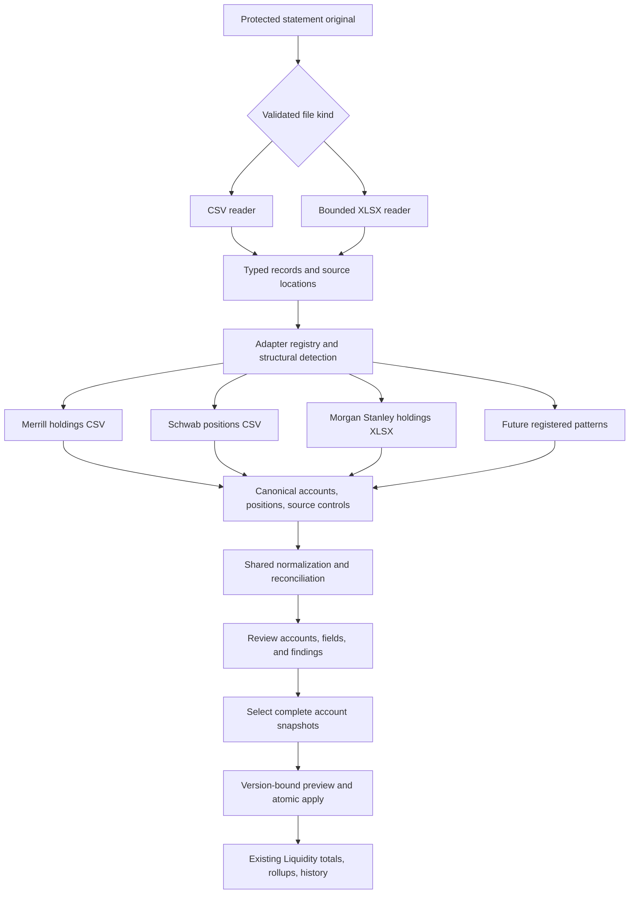

# Implementation Plan: Statement Adapter Normalization

**Branch**: `032-statement-adapter-normalization` | **Date**: 2026-09-28 | **Spec**: [spec.md](./spec.md)

**Input**: Evolve feature 031 into accurate CSV/XLSX holdings ingestion through an adapter per custodian export pattern. User confirmed Codex-assisted adapter onboarding and detection of all supported accounts/sheets with explicit selection of complete account snapshots.

## Summary

Separate file reading from statement interpretation. CSV and XLSX readers produce bounded, typed source records. Registered adapters identify export patterns, extract accounts/positions/controls, and explain every source section. Shared financial rules produce one versioned canonical model, followed by the existing review, reconciliation, account snapshot application, and Liquidity reporting services.

Deliver three initial adapters: Merrill holdings CSV, Charles Schwab positions CSV, and Morgan Stanley holdings XLSX. Preserve 031 imports and approved history. Future formats are added through the [adapter onboarding guide](./adapter-onboarding.md): inspect a sample, establish its semantics, create synthetic expected results, implement one adapter, run conformance tests, and verify the actual upload-to-Liquidity flow.

The feature supports a growing catalog of tested statement patterns. An unfamiliar file remains a draft until its pattern is supported or a valid one-off CSV mapping is reviewed. Transaction-only files, PDF/OCR, Plaid, and general spreadsheet calculation are outside scope.

## Technical Context

**Language/Version**: Node.js 22, TypeScript with the repository API/web configurations, React 19, PostgreSQL 16, PowerShell-compatible tooling.

**Primary Dependencies**: Existing Fastify, Zod, pg, TanStack Query, Vite, AWS object-store utilities, pinned csv-parse 7.0.2, and exact BigInt decimal utilities. Add explicitly pinned ZIP/XML reader dependencies after lockfile, license, and security checks; researched candidates are yauzl 3.4.0 and saxes 6.0.0. Existing ExcelJS remains for exports/test fixture generation, not authoritative numeric input.

**Storage**: Existing protected versioned originals and PostgreSQL import/run/evidence/review/application/account/snapshot/position tables. Add metadata and widen constraints; retain legacy `liquidity_csv_*` names and original keys. No new data store.

**Testing**: Vitest conformance and exact-decimal tests; real PostgreSQL migration, immutable-history, selection, replay, concurrency, and correction tests; browser upload/review/apply tests; authorization, ZIP/XML abuse, parser termination, redaction, and performance tests.

**Target Platform**: Existing local Windows development and deployed API runtime. A bounded worker thread under the current durable job owner isolates parser work; no additional service or paid extraction processor.

**Project Type**: Existing npm-workspaces API/web application with shared contracts.

**Performance Goals**: Upload capability target <2 seconds. At most 2,000 holdings per ordinary file target p95 read/detect/normalize/reconcile <5 seconds. Every configured maximum is tested against deployed API sizing before enablement. Report reads never parse files.

**Constraints**: Complete account snapshots; explicit approval; exact decimals; source provenance; no silent row loss, inferred trades, filename-based identity, artificial zero values, or unreviewed overwrite. No private samples in Git/CI. Compatibility must not silently reprice old holdings.

**Scale/Scope**: Dozens of accounts and hundreds to low thousands of holdings/account. Retain 10 MiB/file, 5,000 positions/file default, 128 columns, 16 KiB/field, one active parser/API process, 30-second work deadline, bounded queue, and at most two transient retries. XLSX-specific proposed ceilings are in [reader contract](./contracts/readers-and-adapters.md); these are limits to verify, not measured capacity claims.

**Data Classification**: Originals, parsed financial evidence, identifiers, reviews, and audit details remain Restricted. Synthetic structure-equivalent fixtures only in the repository.

**Identity/Tenancy**: Existing single tenant and selected entity/custodian per import. Admin mutates imports; scoped users read reports. Worker results never choose authorization scope. Account selections are checked against the persisted import entity/custodian.

**Recovery Objectives**: Inherit <=15-minute RPO, <=8-hour RTO, >=35-day PostgreSQL PITR, and protected versioned object recovery. Additive changes and compatible readers preserve history. Rollback after new-format publication requires a version that can read both formats.

**Compliance/Providers**: No new data processor, training use, business purpose, tenant model, or region. Update existing inventory and incident documentation for ZIP/XML parsing. Existing identity, retention, legal, and recovery obligations are not asserted resolved by this feature.

## Constitution Check

Pre-research check: PASS for planning within the existing application boundaries, with no production mutations, no new data processor, and explicitly inherited authorization/data/recovery obligations. Technical research resolves reader precision, bounds, versioning, and migration choices; product answers are recorded in the specification.

| Gate | Post-design result and evidence |
|---|---|
| Security/privacy | PASS FOR DESIGN: [security contract](./contracts/security-and-operations.md) covers original protection, typed identifier masking, ZIP/XML threats, formula behavior, limits, and inert content. |
| Identity/least privilege | PASS FOR DESIGN: the same contract specifies Admin/entity boundaries, selected account checks, worker scope, and no new cloud permissions. |
| Financial integrity/audit | PASS FOR DESIGN: [normalization contract](./contracts/normalization-and-controls.md) specifies provenance, field precedence, exact units, control scopes, and immutable source versus reviewed values. |
| Architecture/scale | PASS FOR DESIGN: [ADR](./contracts/architecture-decision.md) justifies registry, typed readers, and worker boundary; bounds and deployment-shaped benchmarks precede XLSX enablement. |
| Verification/recovery | PASS FOR DESIGN: [quickstart](./quickstart.md) and [rollout](./contracts/migration-and-rollout.md) define compatibility, selection, cancellation, replay, migration, and recovery evidence. |
| Legal/incident readiness | PASS FOR PLANNING: no new external disclosure or legal-status claim; inherited organizational obligations remain release gates, and inventory/runbook changes are implementation deliverables. |

The three core product questions are resolved in the specification's clarification log. The additional optional masked-account preference retains existing manual confirmation pending an answer, so no unapproved inferred identity mechanism is introduced. Passing design gates does not mean tests, scans, backups, or production checks have already passed.

## Documented Exceptions

None needed for branch creation and planning. Deployment remains outside this request. Existing release rules apply only when the user separately requests deployment from `main`.

## Architecture and ownership



Readers own syntax and source types. Adapters own the meaning and boundaries of one export pattern. Shared rules own derivations and financial consistency. Account matching owns entity/custodian identity. Review owns user corrections and account selection. Apply owns snapshot replacement. Reports own aggregation. Custodian branches do not enter shared financial or report code.

### File reading and registry

- Identify content before selecting a reader; MIME/extension are consistency checks, not proof. Support CSV and standard unencrypted tabular XLSX only.
- Preserve numeric lexemes, sparse addresses, visibility, style hints, date system, and formula-cache provenance. Adapters declare percentage and quote units explicitly.
- Match required header sets, aliases, section labels, and format-specific metadata. Reordered/extra columns may be compatible; duplicate semantic columns, contradictory signatures, unsupported sections, and multiple viable interpretations require a specific finding.
- Match account/table sections, not just the first file header. A single workbook can yield several supported complete account candidates. Overview and detail sections cannot both add the same holdings.
- Use stable family IDs such as `merrill_holdings_csv`, `charles_schwab_positions_csv`, and `morgan_stanley_holdings_xlsx` with separate semantic versions. Preserve old adapter IDs in old drafts and decode them through compatibility aliases.

### Canonical model and financial normalization

Introduce schema 3 with shared `StatementDraft`, discriminated CSV/XLSX evidence, per-section adapter matches, explicit source controls, field interpretations, and valuation conventions. Keep schema 2 readable through an in-memory compatibility projection; do not replace stored payloads or hashes.

Reported complete data takes precedence. Cost basis can be derived from compatible dollar gain or estimated from a compatible percentage; incomplete source basis stays incomplete. Confirmed cash can use cash-at-value rules. A non-cash $1 holding cannot. Store supported extra fields uniformly; preserve unused source information in the protected original and approved supporting evidence.

For Morgan Stanley, the user selected usable Adjusted Cost first and Total Cost fallback when adjusted cost is unavailable. Preserve both source observations and their independently scoped controls.

Source control reconciliation and final portfolio coverage are separate. Compare a partial source footer against its reported source subset, not all normalized basis values. Display the independent source comparison and final known/unknown/estimated coverage. A complete market-value mismatch is actionable; an absent total is not a blocker.

### Multi-account selection and recurring identity

The user confirmed detection of all supported accounts/sheets followed by selection of complete account snapshots. Review must account for every detected candidate as selected or explicitly excluded. Exclusions have reasons and never create empty account snapshots. Unknown sections cannot be excluded to make an incomplete selected account appear complete. Global file-integrity failures still block the whole import.

Apply the chosen accounts atomically. Selections, exclusions, rule versions, account states, and review changes participate in preview hashes. One imported account cannot bind to two existing accounts, and two imported candidates cannot overwrite the same account in one application. Multiple disjoint sections can form one account only when an adapter proves their combination and source controls.

Full reliable identifiers auto-match within entity/custodian scope. Masked-only identifiers can suggest a manually confirmed binding but never silently select it. Recurring masked-only files require confirmation until an unambiguous full identifier is available. Account naming and last four are useful display hints, not identity guarantees.

### Versions, reprocessing, and history

Pin reader, adapter, canonical schema, normalization, reconciliation, classification catalog, structural selection, and mapping revision in each parse recipe. A changed adapter invalidates only affected draft recipes. Existing applied snapshots remain unchanged.

Explicit reprocessing creates a new run against the same immutable source, including previously unsupported files after an adapter is added. It may produce an authorized correction or a later application of formerly excluded accounts. Keep application history; do not invent another source object to bypass duplicate detection.

Keep source duplicate identity after cancelling a correction. Prior-publication comparison uses source, bound target account, effective snapshot identity, and financial contents independent of row/recipe IDs; metadata-only reprocessing cannot publish duplicate financial snapshots.

Fix the existing reparse review-revision collision: import review revisions stay monotonically increasing, and the active review pointer is scoped to the active run. Queueing a new run clears its active review, not the import's historical revision counter. Stale workers, previews, reviews, and idempotency keys cannot apply new contents under old identities.

### Upload, review, and Liquidity integration

Update file input, client validation, upload schema, local binary content parser, S3 headers, object key validation, downloads, and source-kind consumers together. Preserve old `.csv` object keys and existing routes. Label the feature “Upload statements” and accept CSV/XLSX.

Review shows detected format, as-of date, account candidates, source coverage, USD value/basis/gain, editable categories, and direct links to blocking fields. Unsupported layouts clearly request a new adapter. Missing optional fields are quiet availability indicators; acknowledged estimates/cached results remain visible where material.

Keep statement-source pricing off by default. Replace source-kind shortcuts with explicit price/quantity/multiplier/accrual/provider-identity checks before any live repricing or per-unit math. Preserve same-symbol cross-custodian rollups and account subrows, cache invalidation after apply, and persistence after navigation/reload.

Add generic grouping compatibility checks for currency, quantity/price units, and contradictory reliable security identity. Compatible same-symbol holdings still consolidate across descriptions and custodians; incompatible observations cannot silently share quantities or currency labels.

## Project Structure

### Documentation

```text
specs/032-statement-adapter-normalization/
  spec.md
  plan.md
  research.md
  data-model.md
  quickstart.md
  adapter-onboarding.md
  contracts/
    architecture-decision.md
    readers-and-adapters.md
    normalization-and-controls.md
    api-and-review.md
    security-and-operations.md
    migration-and-rollout.md
```

`tasks.md` is intentionally produced later by speckit-tasks, after this plan.

### Source code changes to plan

```text
packages/types/src/liquidity-statements.ts
apps/api/src/modules/liquidity-statements/
  statement-document.types.ts
  statement-draft.compat.ts
  readers/{csv.reader,xlsx.reader,xlsx-package,lexical-decimal}.ts
  adapters/{adapter.types,registry,detect}.ts
  adapters/merrill/holdings-csv.ts
  adapters/charles-schwab/positions-csv.ts
  adapters/morgan-stanley/holdings-xlsx.ts
  statement-processing.worker.ts
  statement-processing.service.ts
  csv/{decimal,normalize,reconcile}.ts
  liquidity-statement.{types,repository,service,handler,routes,zod}.ts
  csv-object-store.ts
  csv-{review,application-preview,application}.service.ts
apps/api/src/infra/db/migrations/
apps/api/src/modules/liquidity-sources/
apps/api/src/modules/reports/consolidatedHoldings.service.ts
apps/api/src/modules/market-data/
apps/api/tests/liquidity-statements/
  adapter-conformance/
  fixtures/{merrill,schwab,morgan-stanley,synthetic-fourth}/
apps/web/src/features/reports/
  api/liquidityStatementsClient.ts
  components/LiquidityCsv*.tsx
  hooks/useLiquidityStatements.ts
```

**Structure decision**: This is a feature-local adapter boundary, not an application-wide plugin system. Retain working module/table names when renaming would only increase churn. Shared public types have one authoritative owner rather than duplicated API/web definitions. Migration filenames use the next available numbers when implementation begins.

## Implementation sequence

1. Characterize existing Merrill/Schwab imports, rule output, symbol rollups, portfolio totals, and monthly replacement with synthetic fixtures. Establish legacy decode and normalized field/control types.
2. Add the adapter interface/registry and wrap the two existing parsers. Verify format detection ambiguity, extra/reordered columns, duplicate headers, row accounting, and 031 behavior parity.
3. Add per-run recipes, source/evidence metadata, run-scoped active reviews, selection/exclusion persistence, neutral source-kind compatibility, and necessary uniqueness/immutability guards through additive migrations.
4. Implement bounded lexical XLSX reading and the terminable parser worker; prove type/date/percentage precision, ZIP/XML limits, no external resolution, and cancellation before enabling the reader.
5. Implement Morgan Stanley using the inspected format, field basis policy, explicit partial controls, cash/product mapping, and bond conventions. Add generic cash/quote/control rule corrections with versioned regression coverage.
6. Extend actual upload/download and review paths for both file types and multi-account selection. Add explicit unsupported/ambiguous/reprocess outcomes and preview invalidation; keep report persistence and aggregation intact.
7. Run three-custodian monthly-sequence, mixed-account, stale preview, correction, unknown-format, browser upload, compatibility, authorization, migration/restore, and resource tests. Add a fourth synthetic adapter to prove extension boundaries.
8. Complete onboarding documentation, dependency/security checks, source-inventory updates, and local acceptance. Only then prepare a separately authorized release under the existing deployment rules.

## Complexity Tracking

No constitutional violation or exception is proposed. The additional registry, typed reader, explicit controls, and bounded worker address demonstrated format, precision, reconciliation, and resource requirements. No reusable mapping product, general Excel engine, AI extraction service, or new infrastructure tier is added.
